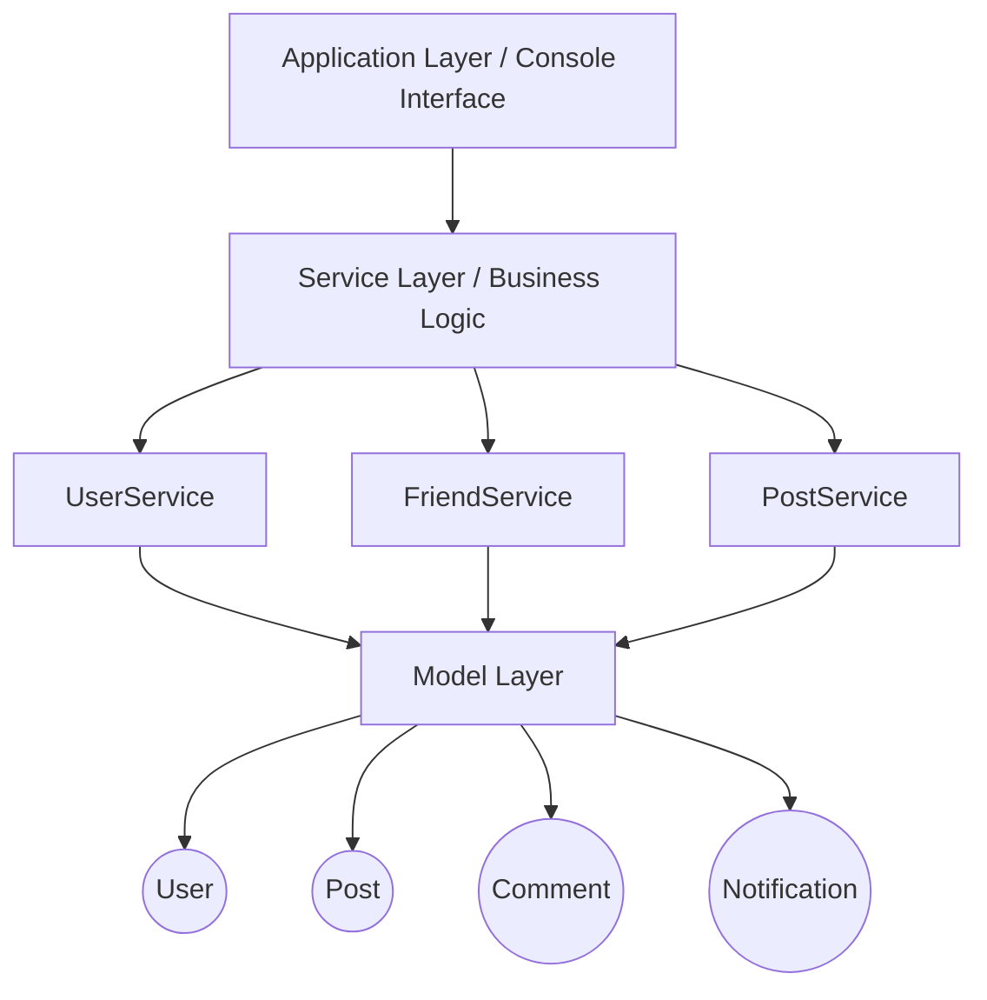
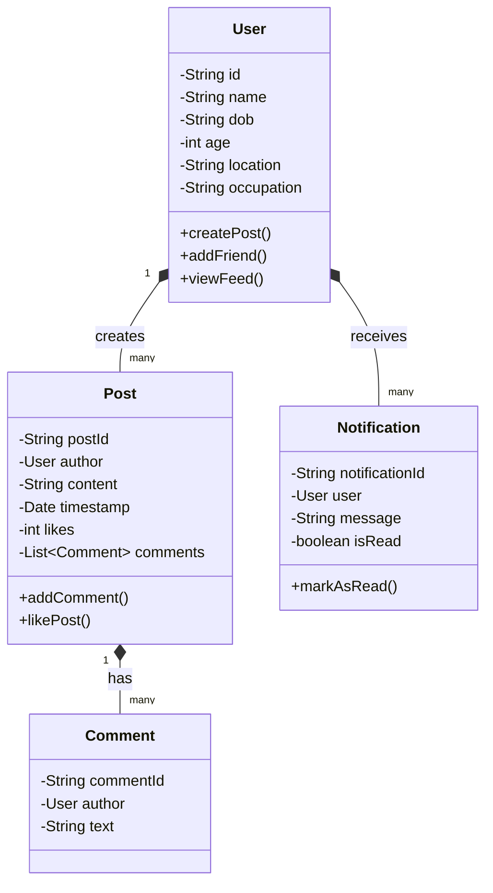
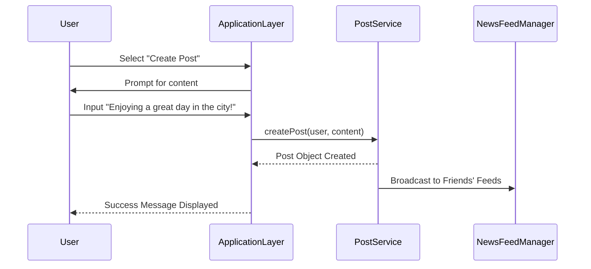

# 🌐 Social Media Console Application (LLD Project)

<p align="center">
  
  
  
  
</p>

## 📌 Overview
This project is a **console-based Social Media Application** developed using **Java and Object-Oriented Programming (OOP) principles**.  
The system simulates the **core backend functionality of a social networking platform**, focusing heavily on **Low-Level Design (LLD)** to ensure modular architecture, robust encapsulation, and a clear separation of business logic across multiple discrete layers.

It allows users to:
- 🧑‍💻 **Create accounts & Manage Profiles**
- 🤝 **Connect with friends**
- 📝 **Create & Share Posts**
- 📰 **View a dynamic News Feed**
- 🔔 **Receive Real-Time Notifications**
- 👥 **Manage Friend Lists**

The main goal is to demonstrate **object-oriented design and system architecture** rather than UI development.

---

## 🎯 Project Objective
The objective of this project is to construct a **modular, scalable, and extensible console-based social networking system** using core **LLD principles**. The application focuses strongly on providing clean interactions between models, decoupled services, and a simplified presentation layer.

---

## 🧠 Low Level Design (LLD) Concepts Used

This project thoroughly demonstrates the following software engineering principles:

### 1️⃣ Object-Oriented Programming (OOP)
The system is built using classes representing real-world entities like `User`, `Post`, `Comment`, `FriendRequest`, and `Notification`.

### 2️⃣ Encapsulation
Data fields within models are strictly maintained as private. Interactions are explicitly managed through comprehensive getter/setter accessors.

### 3️⃣ Separation of Concerns (3-Tier Architecture)
The project separates responsibilities into logical slices:
- **Model Layer**: Core data representation
- **Service Layer**: State orchestration and business rules
- **Application Layer**: Console interaction and payload routing

### 4️⃣ Modular Architecture
Each module is highly cohesive and loosely coupled, making the codebase substantially easier to trace, test, and maintain over time.

---

## 🏗 System Architecture Flow



---

## 📊 UML Class Diagram

The following diagram represents the core structural domain relationships across the platform:



---

## 🔄 Interaction Sequence Diagram (Create Post Flow)

The below sequence represents how the system processes generating a new post in the ecosystem and triggering newsfeed updates.



---

## 📂 Project Structure

```text
SocialMediaApp
│
├── models
│   ├── User.java
│   ├── Post.java
│   ├── Comment.java
│   ├── FriendRequest.java
│   ├── Notification.java
│   └── RequestStatus.java
│
├── services
│   ├── UserService.java
│   ├── FriendService.java
│   └── PostService.java
│
└── app
    └── SocialMediaApplication.java
```

---

## ⚙️ Core Application Flows

### 👤 User Management

Users can create accounts by entering: 
`Name`, `Date of Birth`, `Age`, `Location`, `Occupation`

**Example Output:**
```text
1. Signup
2. Login
3. Exit

Name: pranesh
DOB: 9 aug 2005
Age: 20
Location: chennai
Occupation: gamer

Signup successful!
```

### 🔐 User Login & Dashboard

Users log in by entering their registered name, transitioning them instantly to their personal console dashboard.

**Example Dashboard Output:**
```text
1. Create Post
2. View Feed
3. View Friends
4. Logout
```

### 📝 Post Creation & News Feed Algorithm

Users can seamlessly create posts. The News Feed retrieves and sequences posts generated by the user's connected friends.

**News Feed Output:**
```text
---- NEWS FEED ----

Author: Alice
Post: Enjoying the sunny day in New York!
Likes: 3

Comments:
Bob: Looks amazing!
Charlie: Nice!
```

### 👥 Friend Management

View connected profile links with snapshot data arrays.

**Example Listing:**
```text
--- Friend List ---

Alice | 25 | New York | Designer
Bob   | 24 | London   | Engineer
```

### 🔔 Smart Notification System

A push system triggers alerts passively for user-related state changes:
- Friend requests are sent or accepted.
- A user's post receives a like.
- An interaction (comment/share) occurs on an active thread.

---

## 🛠️ Data Infrastructure & Technologies Used

- **Core Language**: Java
- **Design Philosophy**: Object-Oriented Programming (OOP)
- **Data Persistence**: Java Collections Framework (`ArrayList`, `HashSet`, `HashMap` depending on service need)
- **User Interface**: Traditional terminal/Console-based interactive flow

---

## 🚀 How to Run the Project locally

### 1️⃣ Clone the Repository
```bash
git clone https://github.com/Pranesh003/SocialMediaApplication_LLD.git
```

### 2️⃣ Navigate to the Root Folder
```bash
cd SocialMediaApplication_LLD
```

### 3️⃣ Compile Output Artifacts
```bash
javac app/SocialMediaApplication.java
```

### 4️⃣ Execute Application
```bash
java app.SocialMediaApplication
```

---

## 🎓 Learning Outcomes
This project provided significant experience in understanding:
- Low Level System Design configurations for scalable backends
- Modular software architectural paradigms
- Java OOP enterprise best practices
- Conceptual modeling for high-throughput node relationships (social graphs)
- Complex CLI session and state management

---

## 🔮 Future Enhancements (Roadmap)
- 🤖 **Friend Suggestion Algorithm** (Mutual friend graphing constraint mapping)
- ⏳ **Post Sorting Algorithm upgrades** based strictly on custom timestamps
- 🔍 **Global User Search Module**
- 🗄️ **Persistent Data Storage** utilizing `MySQL` or `MongoDB` architectures
- 🌐 **REST API Implementation Setup** transitioning to Spring Boot 

---

## 👨‍💻 Author

**Pranesh**  
*Game Designer & Developer*  
Specializing in:
- AR/VR/XR  
- Cybersecurity  
- AI-powered interactive applications  

**Key Projects:**  
- TheraGames  
- CyberGuard  

---

## 📜 License
This project is developed primarily for **educational and architectural design portfolio purposes**.
